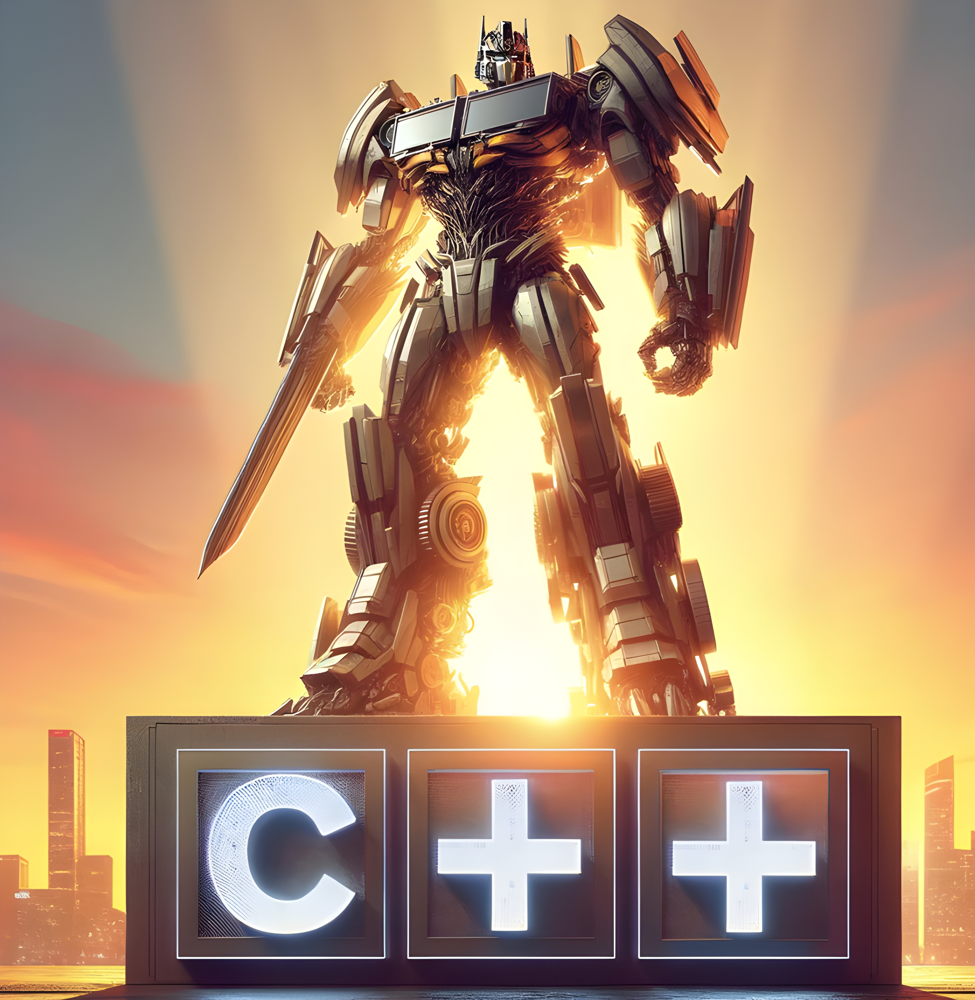

# Simple-LibTorch-Realization-of-Transformer

There are probably one million python realizations of transformer, but definitely fewer ones in C++. So I implemented a very simple transformer model using LibTorch in C++, just as a learning exercise in deep learning and programming. It includes the **model** and **data** parts, as well as **training** and **testing** scripts. As I said, very simple.

Reference: [Pytorch Transformer by Harvard NLP team](https://nlp.seas.harvard.edu/annotated-transformer/)

  
